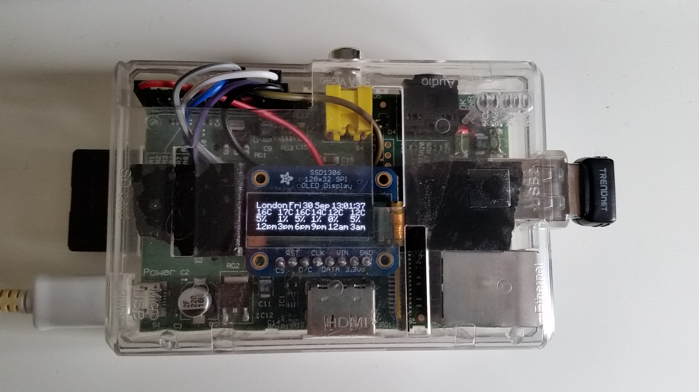

# piweather
Raspberry Pi &amp; SSD1306 OLED project

This project uses a Raspberry Pi B, a Wireless USB dongle and an SSD1306 OLED display to display the current weather and train times for selected locations. Optionally, add a rotary encoder and add your own menus!

<h2>Hardware</h2>
Coming soon

<h2>Software</h2>

Prepare your Pi if possible by using a fresh installation of the <a href="https://www.raspberrypi.org/downloads/raspbian/">latest Raspbian</a>.
Make sure python 2, pip and git are installed, and install the very handy Darwin SOAP client provided by <a href="https://github.com/robert-b-clarke/nre-darwin-py">Robert Clark</a>: 
<code>pip install nre-darwin-py</code> 

There are some prerequisites, git clone and install:
<ul>
<li><a href="https://github.com/adafruit/Adafruit_Python_SSD1306.git">Adafruit_Python_SSD1306</a> (library to draw text and shapes on the SSD1306 OLED)</li>
<li><a href="https://github.com/Gadgetoid/WiringPi2-Python.git">wiringPi2-Python</a> (follow these instructions to install wiringPi)</li>
</ul>

Then clone this repository to your pi: 
<code>git clone https://github.com/mattura/piweather</code> 

Place any True Type font you want in the /fonts/ directory and edit the code,
I used Minecraftia and Everyday (both free for personal use) from here: 
http://www.dafont.com/minecraftia.font 
http://www.dafont.com/everyday.font 

Check your screen runs correctly: 
<code>python scrtest.py</code> 

To access the Met Office Datafeed, you need to register for an api key. Once you have this, copy the key value into the "met.conf" file.

To access the National Rail OpenLDBWS data feed, you need to register for a token. Once you have this, place it into the "nre.conf" file.

Check your apikey and token work: 
Run <code>python cron.py</code> and check for errors, then run <code>ls *.dat</code> and check the dat files have been created

Set up your crontab to run cron.py at regular intervals. I run it every minute between the hours of 5am and 11pm: 
<code>sudo crontab -e</code> 
<code>* 5-23 * * * /usr/bin/python /home/pi/piweather/cron.py</code>

Now you should be set! Try <code>python display.py</code> 
If it works, you can run it on boot by adding a script in <code>/etc/rc.local</code>

